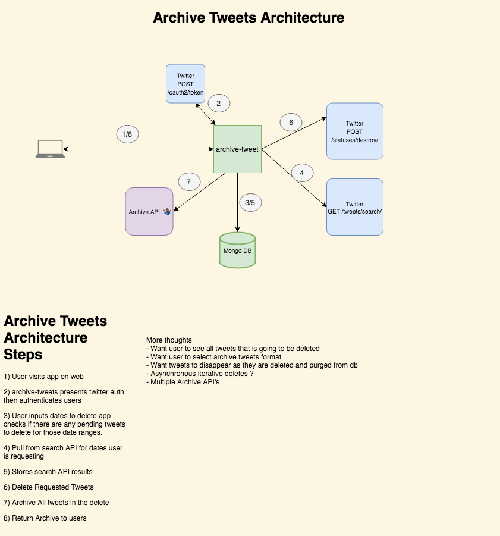

# archive-tweets
A project to save and nuke all tweets from your profile

# Architecture

# Running the code
1. git clone the project 
2. Create an app on https://developer.twitter.com/en/apps. Under Keys & Tokens use the consumer API Keys to create you application.yml. Specify twitter's:
    - API key as your "*clientID*"
    - API secret key as your "*clientSecret*" 
    - https://api.twitter.com/oauth2/token as your accessTokenUri